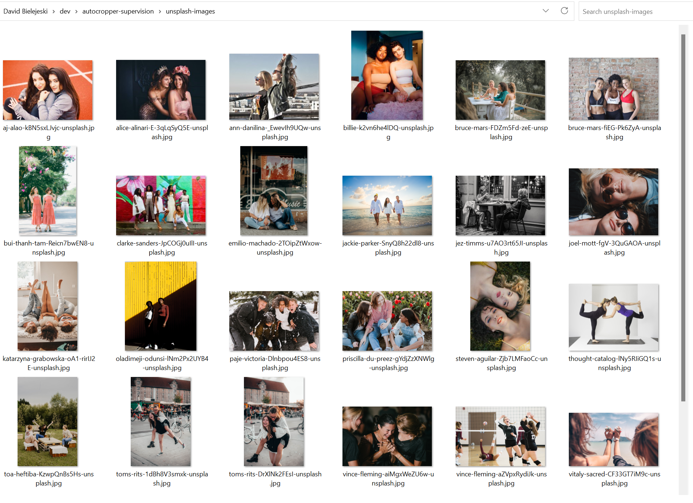
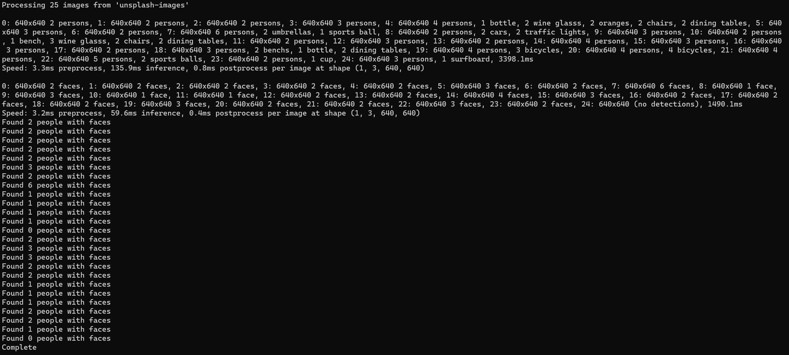
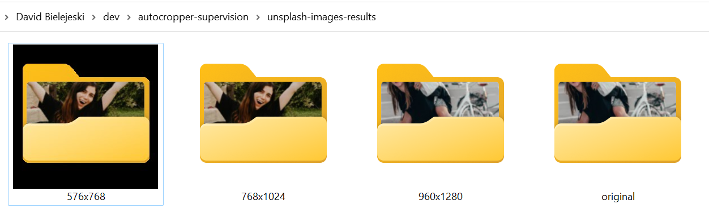
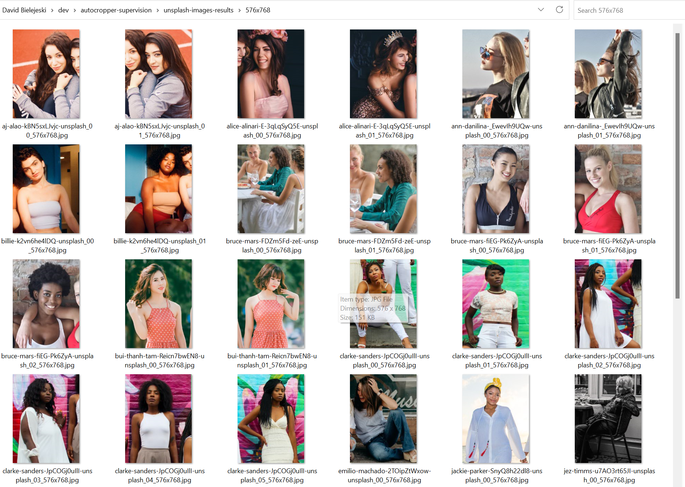

# autocropper-supervision

This utility uses the [YoloV8](https://docs.ultralytics.com/models/yolov8/) model for detecting people, and the [YoloV8-face](https://github.com/akanametov/yolov8-face) model for detecting faces.

It processes a directory of images, detects the people with faces, auto-crops the images (as a copy) and saves them to a specified directory.

### Processing results for 25 images from [Unsplash](https://unsplash.com/collections/201073/friends)

#### Dataset


#### Command
```cmd
python "main.py" --images_directory "unsplash-images" --results_folder "unsplash-images-results" --crop_ratio "(3,4)" --person_percent_detection_cutoff 0.075 --person_padding_percent 0.02
```





### Pre-Requisites

1. [Git](https://gitforwindows.org/)
2. [Python 3.10](https://www.python.org/downloads/)
3. Open `cmd`
4. Clone the repository
    1. `git clone https://github.com/djbielejeski/autocropper-supervision`
5. Navigate into the repository
    1. `cd autocropper-supervision`

### Activate Environment and Install Dependencies

```cmd
python -m venv autocropper-supervision-venv
autocropper-supervision-venv\Scripts\activate.bat
pip install -r requirements.txt
```

#### Run

```cmd
python "main.py" --images_directory "C:/Images"
```

#### Cleanup

```
cmd> deactivate 
```

#### All Arguments

```cmd
python "main.py" --images_directory "C:\\images" --results_folder "C:\\results" --crop_ratio "(3,4)" --person_percent_detection_cutoff 0.075 --person_padding_percent 0.02
```

### Command Line Parameters

| Command                             | Type   | Example         | Description                                                                                                                                                               |
|-------------------------------------|--------|-----------------|---------------------------------------------------------------------------------------------------------------------------------------------------------------------------|
| `--images_directory`                | string | `"C:\\images"`  | The path the images folder to process                                                                                                                                     |
| `--results_folder`                  | string | `"C:\\results"` | *Optional* Defaults to `\results`                                                                                                                                         |
| `--crop_ratio`                      | tuple  | `(3,4)`         | *Optional* Defaults to `(3,4)`. Available Options: `(1,1)`, `(2,3)`, or `(3,4)`                                                                                           |
| `--person_percent_detection_cutoff` | float  | `0.075`         | *Optional* Defaults to `0.075`. Percentage of the overall image that must contain a person to be detected.  Useful for removing background people from the results        |
| `--person_padding_percent `         | float  | `0.02`          | *Optional* Defaults to `0.02`.  Percent of the detected person to add padding for.  Example:  Detected person is `512x512px`, will add `512px * 0.02 => 10px` of padding. |

